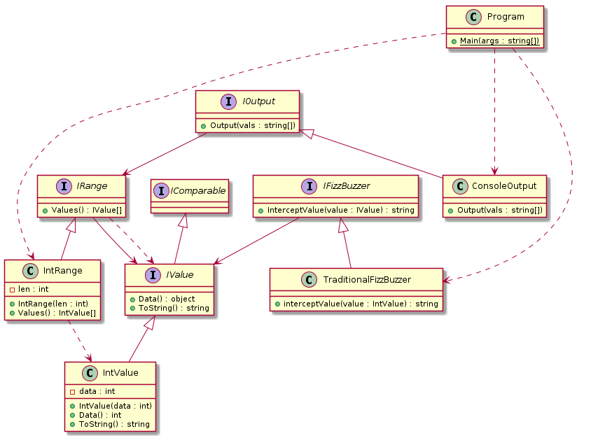

# FunctionalDesignPatterns

## Description

This repo is to remove the misconception that functional programming has no paradigms.

This misunderstanding usually arrives from showing that OOP Design patterns directly translate to a functional programming style. As such, everything is a function, so some misunderstand this as there aren't patterns.

Essentially, a proper object has zero public state. "Best practice" has objects as implementations of interfaces that may have private state under the hood, but from a top-level perspective, they're really containers for functions.

In other words, you can apply many object oriented design patterns by thinking of the objects not as *data*, but rather modules in a functional programming language.

I plan to over-engineer the fizz-buzz problem as a complex OOP program in UML, and I will implement the UML in C# and Haskell.

## Fizz-Buzz Overblown

Alright so the classic fizz buzz problem:

 1. Print the numbers 1 - 100

 2. If a number is a multiple of 3 then print Fizz

 3. If a number is a multiple of 5 then print Buzz

 4. If both, then print both ("FizzBuzz")

Now how can we make this overcomplicated?

Well things can change:

 - Imagine the number can be higher than 100.

 - Imagine numbers other than 3 or 5 print something else.

 - Imagine it doesn't even have to be numbers.

So let's focus on the relationships. There's some range of values. While iterating, a comparison can be drawn between the current value and some other value. If that comparison produces a corresponding result (could be original example: number % 3 == 0, could be something crazier: len(string) < 5), then *output* (note: not necessarily print!) a value. If the comparison is false, output the value itself.

Alright so what are the objects? Well there's some sort of output, there's some sort of iterable, there's some sort of object that's comparable and showable and has a function for fizzbuzz to be true.

Here's my UML:



Ah. Nice and complicated. Obviously there are better ways to do all of these things that I'm trying to do, but it's complicated for the sake of having many objects.

Okay. Now I'll implement the C# first. This is how it's gonna go:

 1. The program will create a "TraditionalFizzBuzzer," a "ConsoleOutput," and an "IntRange" with options equal to 100 (for length)

 2. The program will then "map" the fizz buzzer function to all the values returned by the values() function in the range.

 3. The strings produced by that map will then be output using the console output

However, at the top level, all of these concrete classes are abstracted away, leaving a very simple main method:

```
using System.Linq;

namespace fizzbuzz {
    class Program {
        static void Main(string[] args) {
            IRange range = new IntRange(100);
            IValue[] values = range.Values();
            IFizzBuzzer fizzBuzzer = new TraditionalFizzBuzzer();
            IOutput output = new ConsoleOutput();
            
            var fizzBuzzedData = values.Select(
                fizzBuzzer.InterceptValue
            ).ToArray();
            output.Output(fizzBuzzedData);
        }
    }
}
```

Note that in practice, I'd probably use var for all the created objects, but for this example to show that I'm instancing objects as the interfaces they implement, I've left in the type name.

But yeah. This works. It does fizz buzz, and it could easily be modified to include more number options by editing the TraditionalFizzBuzzer's intercept function, to include non-integer options by creating custom IRanges and FizzBuzzers, etc.

Now I'll show how this can translate almost directly into Haskell:

```
module Main where

import Range(IRange(..), intRange)
import FizzBuzzer(fizzBuzz, traditionalFizzBuzz)
import Output(output, consoleOutput)

main :: IO ()
main = do
    let range = intRange 100
    let vals = values range
    let fizzBuzzedData = map (fizzBuzz traditionalFizzBuzz) vals
    consoleOutput fizzBuzzedData
```

Excluding the differences in syntax, you can see that the main method is almost identical to C#'s implementation.

What I want to suggest here is that OOP isn't a paradigm. Instead it's a way of encapsulating code in the true paradigms which I argue are imperative (ultimately from Turing Machines) and functional (ultimately from Lambda Calculus).

Just as this simple object system can be used in a functional paradigm, so too can other object systems, including common design patterns.

## Build dependencies

 - Linux (since this is an example, I'm not bothering with making my makefile cross-platform and everything. Not super hard to change though)

 - Dotnet core sdk

 - Stack (Haskell)
